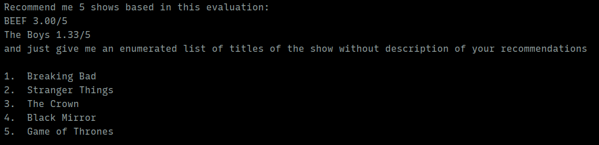

# TV Show Progress Tracker

## Description

This project allows users to track the progress of their favorites tv shows.

## Features:
- Maven Support
- Can gather the information from the internet in order to populate a show with the seasons and episodes.
- Has an admin user, with superpower over the regular users.

## How To Run it.
Download the Maven dependencies.
This works with a MySQL database, so that service needs to be available and running before you make this app run.

## Screenshots
### This is an example of what is going on internally with chat gpt.

