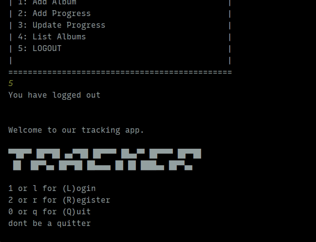

# TV Show Progress Tracker

## Description

This project allows users to track the progress of their favorites tv shows.
It uses an external API and Artificial Intelligence under the hood.

## Features:

- Maven Support
- Can gather the information from the internet in order to populate a show with the seasons and episodes.
- Has an admin user, with superpower over the regular users.
- Users can rate Episodes -> Seasons -> TV shows.
- Freely can create user accounts.
- You Can see a tracker report for a topic as a whole.
- Indicator of how long a user is completing a tv show.

## External Features

- Instead of just adding a tv show manually,
  it calls The Movie Database API to populate your show with all the seasons and
  episodes, so you save a lot of time.
- With the ratings that you provided to the db, it has the option to recommend 5 tv shows to ChatGPT.

> Interactions with data are done with complex queries, in order to optimize the application.

## How To Run it.

Download the Maven dependencies.
This works with a MySQL database, so that service needs to be available and running before you make this app run.

## Screenshots

### This is an example of the workflow for the old app

### This is an example of what is going on internally with chat gpt.

